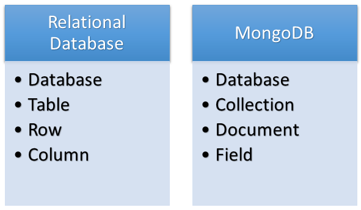
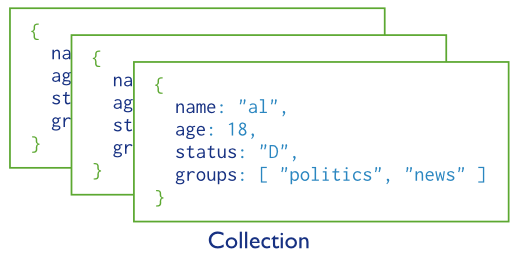
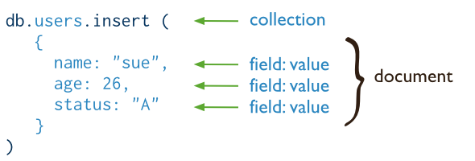
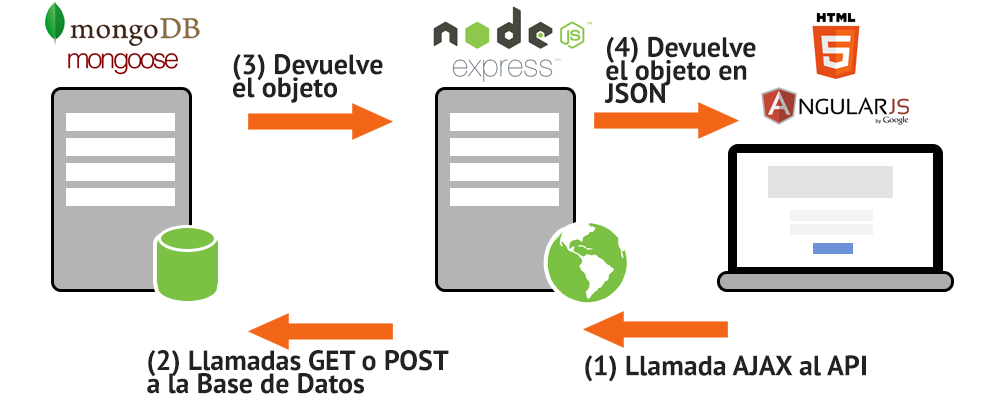
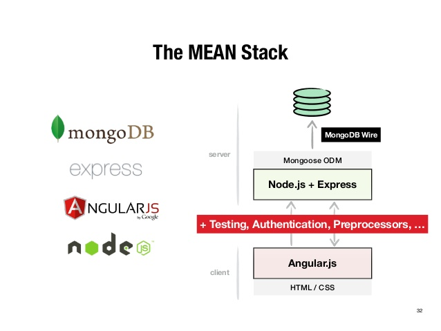
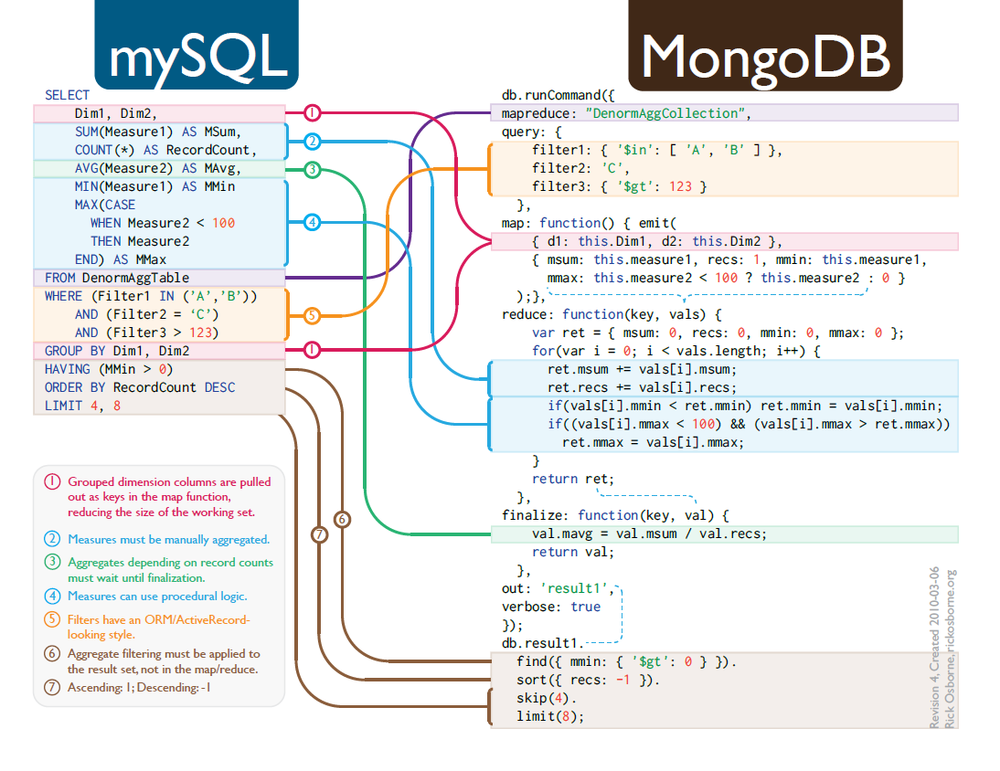

<!-- ######################## MONGO DB ######################## -->

# MongoDB Notes


### **Mongo DB**

> MongoDB is an open-source **document database** that provides high performance, high availability, and automatic scaling.




> **A record in MongoDB is a [document](https://docs.mongodb.com/manual/core/document/)**, which is a data structure composed of field and value pairs. **MongoDB documents are similar to JSON objects**. The values of fields may include other documents, arrays, and arrays of documents.


> MongoDB stores **[BSON documents](https://docs.mongodb.com/manual/reference/bson-types/)**, i.e. data records, **in [collections](https://docs.mongodb.com/manual/core/databases-and-collections/#collections)**; the collections in databases.




### Create a Database and a Collection

```
use myNewDB
db.myNewCollection1.insert( { x: 1 } )
```

### Document example
```
var mydoc = {
   _id: ObjectId("5099803df3f4948bd2f98391"),
   name: { first: "Alan", last: "Turing" },
   birth: new Date('Jun 23, 1912'),
   death: new Date('Jun 07, 1954'),
   contribs: [ "Turing machine", "Turing test", "Turingery" ],
   views : NumberLong(1250000)
}
```

## Documents

- [Field Names](https://docs.mongodb.com/manual/core/document/#field-names) |[ Dot Notation](https://docs.mongodb.com/manual/core/document/#dot-notation)
- [The `_id` Field](https://docs.mongodb.com/manual/core/document/#the-id-field)
- [BSON types](https://docs.mongodb.com/manual/reference/bson-types/)

[_Thinking in documents_](https://www.mongodb.com/blog/post/thinking-documents-part-1)

- [Import Dataset → Restaurants](https://docs.mongodb.com/getting-started/node/import-data/)


## Installation and Use

 - Installation <a class="icon-windows ml-xl" href="https://docs.mongodb.com/manual/tutorial/install-mongodb-on-windows/"></a> <a style="margin-left:40px !important;" class="icon-apple ml-xl" href="https://docs.mongodb.com/manual/tutorial/install-mongodb-on-os-x/"></a>

- [Using mongoDB](http://stackoverflow.com/questions/4883045/mongodb-difference-between-running-mongo-and-mongod-databases) [[1]](http://michelebusta.com/the-little-things-5-initialize-a-local-mongo-db/)
    + [`mongod`](https://docs.mongodb.com/manual/reference/program/mongod/) ⟶ The Daemon
      + `mongod --dbpath ~/data/db`
    + [`mongo`](https://docs.mongodb.com/manual/mongo/) ⟶ The Shell ([**Reference Guide**](https://docs.mongodb.com/manual/reference/mongo-shell/)) → [Mongo Hacker](https://github.com/TylerBrock/mongo-hacker) 😎
      + `show dbs` & `use ProjectDBName` & `show collections`
      + `db.collection.help()` & `db.collection.find().help()`

> Create or insert operations **add new documents to a collection**.




> Read operations retrieves documents from a collection; i.e. **queries a collection for documents**.


> Update operations **modify existing documents in a collection**


> Delete operations **remove documents from a collection**


## [CRUD Operations](https://docs.mongodb.com/manual/crud/)

* [Insert Documents](https://docs.mongodb.com/manual/tutorial/insert-documents/#insert-documents)
  + [`db.collection.insertOne()`](https://docs.mongodb.com/manual/tutorial/insert-documents/#db-collection-insertone)
  + [`db.collection.insertMany()`](https://docs.mongodb.com/manual/tutorial/insert-documents/#db-collection-insertone)
  + [`db.collection.insert()`](https://docs.mongodb.com/manual/tutorial/insert-documents/#db-collection-insert)
- [Query Documents](https://docs.mongodb.com/manual/tutorial/query-documents/)
  - [`db.collection.find()`](https://docs.mongodb.com/manual/reference/method/db.collection.find/#db.collection.find)
* [Update Documents](https://docs.mongodb.com/manual/tutorial/update-documents/)
  + [`db.collection.update()`](https://docs.mongodb.com/manual/reference/method/db.collection.update/#db.collection.update)
  + [`db.collection.updateOne()`](https://docs.mongodb.com/manual/reference/method/db.collection.updateOne/#db.collection.updateOne)
  + [`db.collection.updateMany()`](https://docs.mongodb.com/manual/reference/method/db.collection.updateMany/#db.collection.updateMany)

- [Remove Documents](https://docs.mongodb.com/manual/tutorial/remove-documents/)
  - [`db.collection.remove()`](https://docs.mongodb.com/manual/reference/method/db.collection.remove/#db.collection.remove)
  - [`db.collection.deleteOne()`](https://docs.mongodb.com/manual/reference/method/db.collection.deleteOne/#db.collection.deleteOne)
  - [`db.collection.deleteMany()`](https://docs.mongodb.com/manual/reference/method/db.collection.deleteMany/#db.collection.deleteMany)


## [Mongo & Node](https://docs.mongodb.com/getting-started/node/)

- [`mongodb`](https://www.npmjs.com/package/mongodb)
  + [The Node.js Driver](https://www.youtube.com/watch?v=u3FLcQmaj1E)

```
var MongoClient = require('mongodb').MongoClient;

// Connection URL
var url = 'mongodb://localhost:27017/myproject';
// Use connect method to connect to the Server
MongoClient.connect(url, function(err, db) {
  console.log("Connected correctly to server");
  db.close();
});
```

## Mongo & Node

- [Find or Query Data](https://docs.mongodb.com/getting-started/node/query/) [[1]](https://www.npmjs.com/package/mongodb#find-all-documents)
  - return [cursor](https://mongodb.github.io/node-mongodb-native/api-generated/cursor.html#cursor) where we can apply [lots of methods](https://docs.mongodb.com/manual/reference/method/js-cursor/)
  - [`toArray`](https://mongodb.github.io/node-mongodb-native/api-generated/cursor.html#toarray) to convert cursor into array of objects

```
db.collection('restaurants')
  .find( )
  .forEach( (myDoc) => console.log (doc) );
```

```
db.collection('restaurants')
  .find( )
  .toArray( (err, docs) => console.log (docs) );
```

```
{
      "address" : {
         "street" : "2 Avenue",
         "zipcode" : "10075",
         "building" : "1480",
         "coord" : [ -73.9557413, 40.7720266 ]
      },
      "borough" : "Manhattan",
      "cuisine" : "Italian",
      "grades" : [
         {
            "date" : new Date("2014-10-01T00:00:00Z"),
            "grade" : "A",
            "score" : 11
         },
         {
            "date" : new Date("2014-01-16T00:00:00Z"),
            "grade" : "B",
            "score" : 17
         }
      ],
      "name" : "Vella",
      "restaurant_id" : "41704620"
   }
```

## Queries

```
db.collection('restaurants')...
  .find( )
  .find( { "borough": "Manhattan" } )
  .find( { "address.zipcode": "10075" } )
  .find( { "grades.grade": "B" } )
  .find( { "grades.score": { $gt: 30 } } ) // greater than
  .find( { "grades.score": { $lt: 10 } } ) // greater than
  .find( { "cuisine": "Italian", "address.zipcode": "10075" }) // AND
  .find( { $or: [
    { "cuisine": "Italian" },
    { "address.zipcode": "10075" }
  ]}) // OR
  .find().sort( { "borough": 1, "address.zipcode": 1 } );

```

```
[...
{
   "_id" : 3,
   "name" : "ahn",
   "age" : 22,
   "type" : 2,
   "status" : "A",
   "favorites" : { "artist" : "Cassatt", "food" : "cake" },
   "finished" : [ 6 ],
   "badges" : [ "blue", "red" ],
   "points" : [ { "points" : 81, "bonus" : 8 }, { "points" : 55, "bonus" : 20 } ]
}
{
   "_id" : 6,
   "name" : "abc",
   "age" : 43,
   "type" : 1,
   "status" : "A",
   "favorites" : { "food" : "pizza", "artist" : "Picasso" },
   "finished" : [ 18, 12 ],
   "badges" : [ "black", "blue" ],
   "points" : [ { "points" : 78, "bonus" : 8 }, { "points" : 57, "bonus" : 7 } ]
}
...]
```

## [Projections](https://docs.mongodb.com/manual/tutorial/project-fields-from-query-results/)

```
db.collection('users')...
  .find( { status: "A" } )
  .find( { status: "A" }, { name: 1, status: 1 } )
  .find( { status: "A" }, { name: 1, status: 1, _id: 0 } )
  .find( { status: "A" }, { favorites: 0, points: 0 } ) // all but excluded
  .find(
     { status: "A" },
     { name: 1, status: 1, "favorites.food": 1 }
  ) // Specific Fields in Embedded Documents
```


## Mongo & Node

- [Insert Data](https://docs.mongodb.com/getting-started/node/insert/) [[1]](https://www.npmjs.com/package/mongodb#inserting-a-document)
  - [`insertOne`](http://mongodb.github.io/node-mongodb-native/2.0/api/Collection.html#insertOne) | [`insertMany`](http://mongodb.github.io/node-mongodb-native/2.0/api/Collection.html#insertMany)
- [Update Data](https://docs.mongodb.com/getting-started/node/update/) [[1]](https://www.npmjs.com/package/mongodb#updating-a-document)
- [Remove Data](https://docs.mongodb.com/getting-started/node/remove/) [[1]](https://www.npmjs.com/package/mongodb#delete-a-document)

## <span class="icon-laptop"></span> Mongo NodeSchool Kata

- Do the coding exercises suggested at the NodeSchool workshop: https://github.com/evanlucas/learnyoumongo

## <span class="icon-laptop"></span> API w/ Mongo Exercises

Do the followig exercises: https://github.com/juanmaguitar/node-exercises/tree/master/03-mongo-exercises

## Data Modeling

- 6 Rules of Thumb for MongoDB Schema Design [[1]](http://blog.mongodb.org/post/87200945828/6-rules-of-thumb-for-mongodb-schema-design-part-1) [[2]](http://blog.mongodb.org/post/87892923503/6-rules-of-thumb-for-mongodb-schema-design-part-2) [[3]](http://blog.mongodb.org/post/88473035333/6-rules-of-thumb-for-mongodb-schema-design-part-3)
- [Data Modeling Deep Dive](https://www.mongodb.com/presentations/data-modeling-deep-dive)
- [Optimize Query Performance](https://docs.mongodb.com/v3.2/tutorial/optimize-query-performance-with-indexes-and-projections/)
- [Compound Indexes](https://docs.mongodb.com/v3.2/core/index-compound/)
  - [Optimizing MongoDB Compound Indexes](https://dzone.com/articles/optimizing-mongodb-compound) [[1]](http://blog.mlab.com/2012/06/cardinal-ins/)

## Data Modeling

- [Data Models](https://docs.mongodb.com/manual/data-modeling/)
  - [Intro](https://docs.mongodb.com/manual/core/data-modeling-introduction/)
  - Relationships between data represented w/ → **[references](https://docs.mongodb.com/manual/core/data-modeling-introduction/#references)** ([_normalized data models_](https://docs.mongodb.com/manual/core/data-model-design/#data-modeling-referencing)) and **[embedded documents](https://docs.mongodb.com/manual/core/data-modeling-introduction/#embedded-data)** ([_denormalized data models_](https://docs.mongodb.com/manual/core/data-model-design/#data-modeling-embedding))
  - [Validation](https://docs.mongodb.com/manual/core/document-validation/)
  - [Data Models & Operational Factors](https://docs.mongodb.com/manual/core/data-models/)
    Embedded & Normalized Data Models, Document Growth, Atomicity, Sharding, Indexes...


## Data Modeling

- [Examples & Patterns](https://docs.mongodb.com/manual/applications/data-models/)
  - [Model **One-to-One** Relationships with Embedded Documents](https://docs.mongodb.com/manual/tutorial/model-embedded-one-to-one-relationships-between-documents/) → Ex: User w/ One Address
  - [Model **One-to-Many** (_to-Few_) Relationships with Embedded Documents](https://docs.mongodb.com/manual/tutorial/model-embedded-one-to-many-relationships-between-documents/) → Ex: User w/ Multiple Addresses
  - [Model **One-to-Many** Relationships with Document References](https://docs.mongodb.com/manual/tutorial/model-referenced-one-to-many-relationships-between-documents/) → Ex: Books & Publisher relationships
  - [Model **Tree** Structures](https://docs.mongodb.com/manual/applications/data-models-tree-structures/) → Ex: Products, Categories & Subcategories
- [SQL vs MongoDB](http://code.tutsplus.com/articles/mapping-relational-databases-and-sql-to-mongodb--net-35650) [[1]](http://blog.mongodb.org/post/72874267152/transitioning-from-relational-databases-to-mongodb)
- [Use Cases](https://docs.mongodb.com/ecosystem/use-cases/)

## Aggregation

- Joins and Other Aggregation Enhancements [[1]](https://www.mongodb.com/blog/post/joins-and-other-aggregation-enhancements-coming-in-mongodb-3-2-part-1-of-3-introduction) [[2]](https://www.mongodb.com/blog/post/joins-and-other-aggregation-enhancements-coming-in-mongodb-3-2-part-2-of-3-worked-examples) [[3]](https://www.mongodb.com/blog/post/joins-and-other-aggregation-enhancements-coming-in-mongodb-3-2-part-3-of-3-adding-some-code-glue-and-geolocation) [[*]](http://www.clusterdb.com/mongodb/joins-and-other-aggregation-enhancements-in-mongodb-3-2)

- [`$lookup`](https://docs.mongodb.com/manual/reference/operator/aggregation/lookup/) | [`$match`](https://docs.mongodb.com/manual/reference/operator/aggregation/lookup/)

- [Using JOINs in MongoDB NoSQL Databases](https://www.sitepoint.com/using-joins-in-mongodb-nosql-databases/)


> [Mongoose](http://mongoosejs.com/)  is an object modeling package for Node that essentially works like an ORM


## [Mongoose](http://mongoosejs.com/)

* [Schema](http://learnmongodbthehardway.com/schema/chapter1/)
  * [Basics](http://learnmongodbthehardway.com/schema/chapter2/)
  * [Referencing schemas in properties](https://alexanderzeitler.com/articles/mongoose-referencing-schema-in-properties-and-arrays/)
  * [Methods](http://mongoosejs.com/docs/2.7.x/docs/methods-statics.html)
- [Mongoose Connection best practice](http://theholmesoffice.com/mongoose-connection-best-practice/) | [_code_](https://github.com/simonholmes/mongoose-default-connection)
- [Node & Mongo w/ Mongoose](https://scotch.io/tutorials/using-mongoosejs-in-node-js-and-mongodb-applications)
  + [`mongoose-express-router`](https://github.com/alexmingoia/mongoose-express-router)
- Troubleshooting: [[1]](http://stackoverflow.com/questions/10547118/why-does-mongoose-always-add-an-s-to-the-end-of-my-collection-name)

## Cheatsheets & Quick Guides

- [Mongo Booklet](https://s3.amazonaws.com/info-mongodb-com/mongodb_qrc_booklet.pdf)
- [Shell Cheat Sheet](http://www.mongodbspain.com/wp-content/uploads/2014/03/MongoDBSpain-CheetSheet.pdf)
- [Mongo CheatSheet](https://blog.codecentric.de/files/2012/12/MongoDB-CheatSheet-v1_0.pdf)
- [CRUD Operations](http://proserge.kh.ua/coding/index.php/post/31/MongoDB+for+NodeJs+devs+week2%3A+CRUD)

## More resources for this Unit

- Getting started w/ MongoDB [[1]](http://code.tutsplus.com/tutorials/getting-started-with-mongodb-part-1--net-22879) [[2]](http://code.tutsplus.com/tutorials/getting-started-with-mongodb-part-2--net-23636)
- [MongoDb Tutorial](http://codehero.co/series/mongodb-desde-cero.html)
- [Tips and Tricks](https://www.safaribooksonline.com/library/view/50-tips-and/9781449306779/)
- [SQL to MongoDB Mapping Chart](https://docs.mongodb.com/manual/reference/sql-comparison/)
- [Deploy app w/ REST API (Express & Mongo) & Angular to Heroku](https://www.sitepoint.com/deploy-rest-api-in-30-mins-mlab-heroku/)
- [**User Authentication w/ MEAN Stack**](https://www.sitepoint.com/user-authentication-mean-stack/)
  + [Store Passwords in DB](http://sahatyalkabov.com/how-to-implement-password-reset-in-nodejs/) | [JSON Web Tokens](https://scotch.io/tutorials/authenticate-a-node-js-api-with-json-web-tokens)

## <span class="icon-laptop"></span> Mongo Express TO-DO App

- Improve your to-do app by persiting data in a mongoDB








## MEAN Stack

- [Exercise: CRUD App](https://www.airpair.com/javascript/complete-expressjs-nodejs-mongodb-crud-skeleton)

